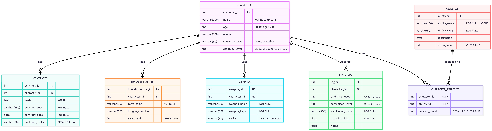
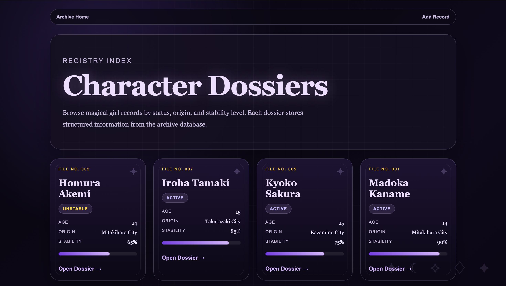
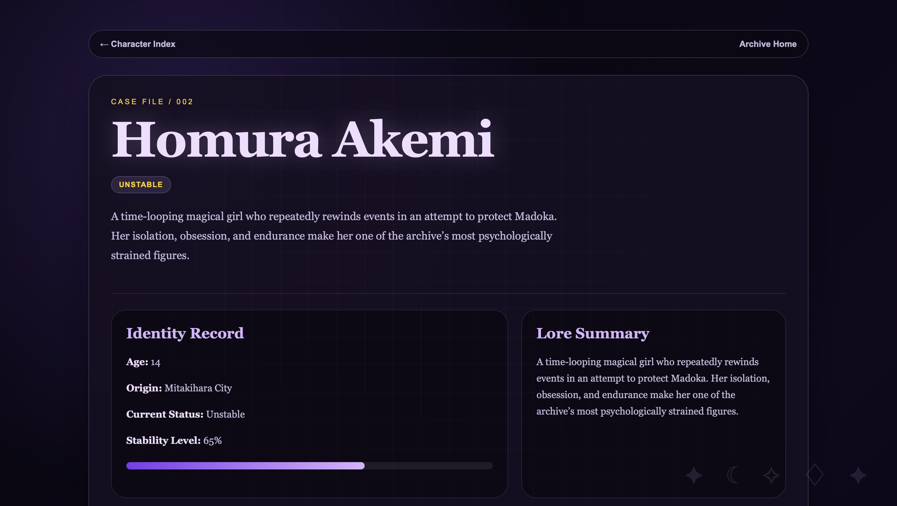
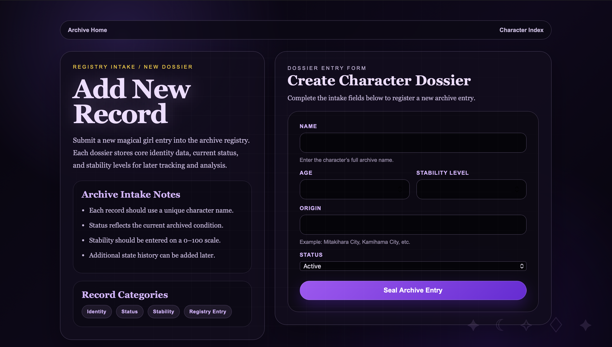

# Magical Girl Archive System

## Project Description

The Magical Girl Archive System is a MySQL & Python based database which acts as a tracker for magical girl characters. The database stores their abilities, contracts, weapons, transformation states and physical condition changing through time.

The chosen topic interested me due to the darker and psychological nature found in certain magical girl series. Unlike storing simple character stats and information, this archive represents character evolution by organizing the progression with attributes like stability, corruption, emotional status, contract, and probability of transformation into a different persona.

This project includes both a command-line Python app and a Flask web interface. The command-line app handles the main database features, while the web app presents the information like an archive of character dossiers.

---

## Technologies Used

- Python
- MySQL
- mysql-connector-python
- Flask
- HTML
- CSS
- GitHub

---

## Database Tables

### characters
Stores the main character information, including name, age, origin, current status, stability level, and lore summary.

### contracts
Stores each character’s wish, contract cost, date, and contract status.

### abilities
Stores magical abilities, including type, description, and power level.

### character_abilities
Connects characters and abilities. This creates the M:M relationship because one character can have multiple abilities, and one ability can be shared by multiple characters.

### transformations
Stores transformation forms, trigger conditions, and risk levels.

### weapons
Stores each character’s weapon information, including name, type, and rarity.

### state_log
Tracks changes in a character’s condition over time, including stability, corruption, emotional state, date, and notes.

---

## Features

### Command-Line App

The command-line app can:

- Connect to the MySQL database
- Display a menu
- View all characters
- Search for a character by name
- View characters with low stability
- View character abilities
- Add new characters
- Add new abilities
- Update a character’s stability
- Delete a character with confirmation
- Apply a state change using a transaction

### Web App

The Flask web app includes:

- A gothic archive-style home page
- A character dossier index
- Character detail pages
- Lore summaries
- Weapons, abilities, contracts, and transformations
- State history logs
- An add character form

---

## ERD



---

## Screenshots

### Home Page


### Character Index


### Character Detail Page


### Add Character Page


---

## Setup Instructions

### 1. Clone the repository

```bash
git clone https://github.com/LKW000/Magical-Girl-Archive-System.git
cd Magical-Girl-Archive-System